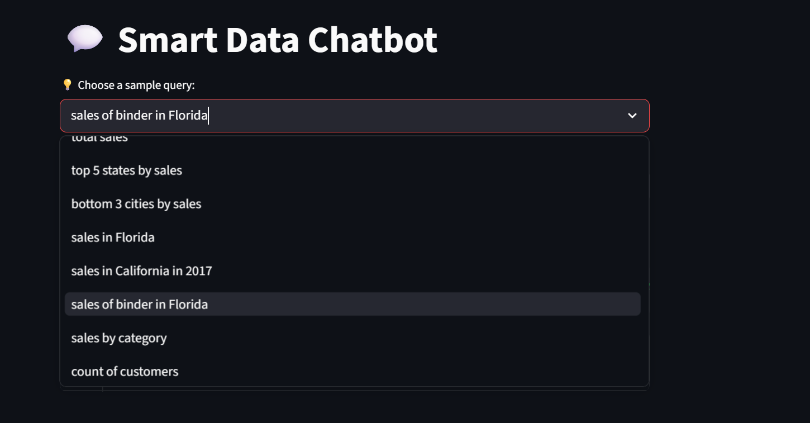
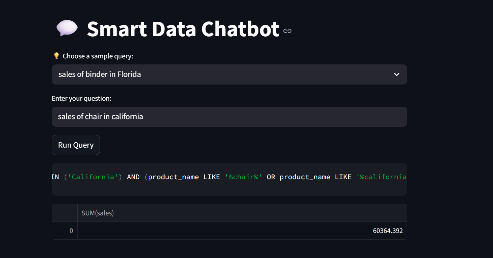

# 💬 Smart Data Chatbot (Natural Language → SQL)

## 📌 Overview
This project allows users to query data using simple English instead of SQL.

---

## 📸 Preview

### Query Suggestions Dropdown

### Query Result Example

---

## 🚀 Features

- Natural language queries  
- Automatic SQL generation  
- Data aggregation (SUM, AVG, MIN, MAX, COUNT)  
- Filtering (State, City, Category, Product)  
- Multi-condition queries  
- Data visualization  
- Query suggestion dropdown  

---

## 🧰 Technologies Used

- Python  
- Streamlit  
- SQLite  
- Pandas  

---

## 🖥️ How to Run

Install dependencies:

pip install streamlit pandas

Run the app:

streamlit run app.py

Open in browser:

http://localhost:8501

---

## 🧪 Example Queries

- total sales  
- top 5 states by sales  
- bottom 3 cities by sales  
- sales in Florida  
- sales of binder in Florida  
- sales in Texas and New York  

---

## ⚠️ Limitations

- Rule-based system  
- Limited understanding of complex queries  

---

## 🔮 Future Improvements

- Add AI  
- Improve UI  
- Handle typos  

---

## 👨‍💻 Author

Shantanu Singla
